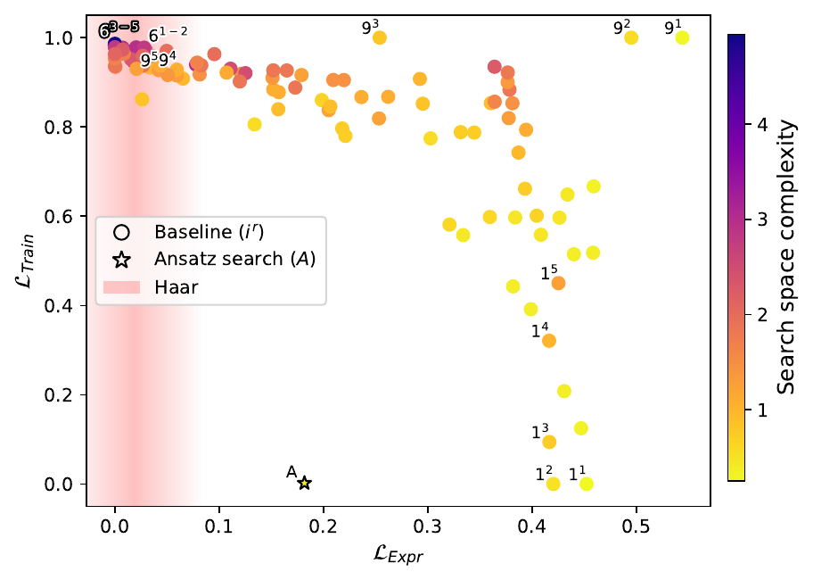
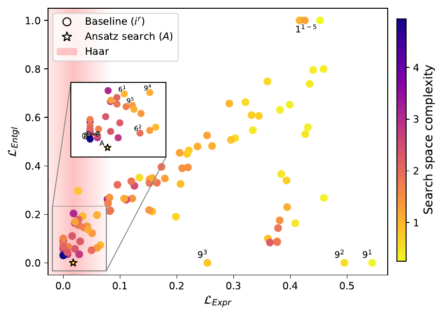

<h1 align="center">ansatz-search</h1>

<p align="center"><b>Find parameterized quantum circuits that are both expressive and trainable.</b></p>

<p align="center">
  <a href="https://arxiv.org/abs/2603.14451"></a>
  <a href="https://github.com/proeseler/ansatz-search/actions/workflows/tests.yml"></a>
  
  <a href="LICENSE"></a>
</p>

<p align="center">
  <a href="https://www.fz-juelich.de/profile/roeseler_p"><b>Peter Röseler</b></a>,
  <a href="https://www.fz-juelich.de/profile/willsch_d"><b>Dennis Willsch</b></a>,
  <a href="https://www.fz-juelich.de/profile/michielsen_k"><b>Kristel Michielsen</b></a><br>
  Jülich Supercomputing Centre
</p>

<p align="center">
  
  
</p>
<p align="center"><sub>
  Lower is better on both axes. Commonly used circuits (the 19 of Sim et al., 2019, with 1–5
  layers) trade expressibility against trainability (left) and entanglement (right); the circuits
  found by the search (★) lie closer to the ideal lower-left corner than any of them. Fig. 2 of the paper.
</sub></p>

**ansatz-search** scores candidate circuits with metrics (expressibility, trainability,
entanglement, gate error, complexity) and searches over circuit structures for the ones that
meet all of them, on NumPy, PennyLane, Qiskit or real IBM quantum computers. It is the code
accompanying

> P. Röseler, D. Willsch, K. Michielsen,
> *How to find expressible and trainable parameterized quantum circuits?*,
> [arXiv:2603.14451](https://arxiv.org/abs/2603.14451) (2026).

- **Metrics:** expressibility, trainability (gradient-to-noise ratio), gradient variance,
  entanglement, gate error and complexity, combined by priority with thresholds and weights.
- **Backends:** a fast batched NumPy simulator (the default), PennyLane, and Qiskit, including
  simulated and real IBM quantum computers.
- **Search:** Bayesian optimization (Optuna) over circuits built gate by gate, with limits on
  parameters, gates and depth, and resumable storage.
- **Evaluation:** re-evaluate the best circuits on fresh seeds next to the 19 benchmark
  circuits of Sim et al. (2019), and plot the results.

## Installation

```bash
pip install "ansatz-search[plot] @ git+https://github.com/proeseler/ansatz-search.git"
```

Optional extras, e.g. `ansatz-search[plot,ibm]`:

| Extra | Adds |
|---|---|
| `plot` | plots of evaluations (matplotlib) |
| `pennylane` | the PennyLane backend (`lightning.qubit` for larger circuits); needs Python ≥ 3.11 |
| `ibm` | simulated IBM devices and real hardware (qiskit-ibm-runtime, qiskit-aer) |
| `datasets` | the Iris feature-map input states (scikit-learn) |

For development, from a clone: `uv sync --all-extras` and `uv run pytest`.

## Quickstart

```python
from ansatz_search import BayesianOptimizationSearch, HierarchicalCostFunction, SearchProblem, ansatz_search, evaluate
from ansatz_search.metrics import Expressibility, GradientVariance

# 1. What to search for: trainable and expressive 4-qubit circuits.
problem = SearchProblem(
    cost_fn=HierarchicalCostFunction({0: [
        GradientVariance(observables="ZZZZ", max_variance=0.1),
        Expressibility(num_qubits=4, log_scale=True),
    ]}),
    num_qubits=4, allowed_gates=["rx", "ry", "rz", "cx", "crz"], max_param=12, max_gates=24, max_depth=16,
)

# 2. How to search: Bayesian optimization, 100 trials; the run is stored in runs/quickstart.
result = ansatz_search(problem, BayesianOptimizationSearch(seed=42), fdata="runs/quickstart")

# 3. Re-evaluate the 5 best circuits on fresh seeds, next to the Sim et al. (2019) circuits.
evaluation = evaluate(result, baselines="sim2019")
print(evaluation)
evaluation.plot(out="runs/quickstart/eval.png")
```

This runs in about a minute. More in [examples/](examples/README.md): a custom metric,
expressibility on a simulated IBM device, and the metrics of the Sim et al. (2019) circuits.

## Concepts

**`SearchProblem`**: the cost function, the number of qubits, the allowed gates (e.g. `h`, `rx`,
`ry`, `rz`, `cx`, `cz`, `crx`, `crz`) and the limits `max_param`, `max_gates` and `max_depth`.

**Cost function**: `HierarchicalCostFunction({priority: [metrics]})` minimizes the metrics of
priority 0 first; later priorities only count once earlier ones are met. A group's score is the
sum of its metrics' costs (`aggregate="mean"` averages them), and missing an earlier priority
always costs more than anything in a later one (Eqs. 28–29 of the paper).
`thresholds={"metric name": value}` sets when a metric counts as met, in the metric's own units,
and `weights={"metric name": w}` makes a metric count more within its group.

**Metrics** return a raw `value` and a `cost` in [0, 1] (lower is better):

| Metric | Raw value | Better | Cost |
|---|---|---|---|
| `Expressibility` | KL divergence to Haar-random fidelities (Sim et al.) | lower | normalized between the finite-sample noise floor and the maximum; `log_scale=True` for the paper's Eq. 8 |
| `Trainability` | gradient variance / gate error | higher | `max(1 - ratio / max_ratio, 0)` |
| `GradientVariance` | expected variance of clipped gradients | higher | `max(1 - variance / max_variance, 0)` |
| `Entanglement` | Meyer–Wallach Q | higher | `max(1 - Q / reference, 0)` |
| `GateError` | `1 - (1 - p1)^N1 (1 - p2)^N2` | lower | the value itself |
| `Complexity` | parameters + gates + depth | lower | divided by the limits |

**Backends**: `ansatz_search(..., compiler=...)` selects one; metrics created without a provider
use the providers of that backend.

| Backend | Compiler | Use it for |
|---|---|---|
| NumPy (default) | `NumpyCompiler` | the usual search sizes: batched over all samples, exact adjoint gradients |
| PennyLane | `PennyLaneCompiler` | larger circuits (`lightning.qubit`) |
| Qiskit | `QiskitCompiler` | Qiskit primitives, simulated IBM devices and real hardware |

**Search**: `BayesianOptimizationSearch(n_trials=100, seed=...)`, which builds circuits gate by gate
(`IncrementalAnsatzBuilder`, the default `builder`). The run folder `fdata`
holds `config.yaml` and the stored trials, so a search can be resumed, and
`load_search(folder, cost_fn=...)` reloads it later, e.g. for `evaluate`.

**Evaluation**: `evaluate(result or {label: circuit}, top=..., seeds=..., baselines="sim2019")`
re-evaluates circuits with fresh seeds (a search's recorded values are optimistic),
`print(evaluation)` shows a table, and `evaluation.plot()` draws one panel per metric.
Every metric can be rebuilt with another seed via `metric.with_seed(seed)`.

## Reproducing the paper

The paper's definitions correspond to these settings:

- **Expressibility** (Eq. 8): 75 bins, `num_of_param_samples=10000` (the paper's 5,000 pairs),
  `log_scale=True`, and the threshold on the cost function, `thresholds={"expressibility": 0.005}`.
- **Trainability** (Eq. 20): `Trainability(observables="ZIII")` with its defaults (uniform
  parameters in [0, 2π), 11,806 samples, `p1_err=0.001`, `p2_err=0.01`, gates counted as written)
  and `thresholds={"trainability": tau_BP}`. Observable strings list qubit 0 first: `"ZIII"` is
  Qiskit's `IIIZ`.
- **Objective**: `HierarchicalCostFunction` with the default `aggregate="sum"`.
- **Thresholds** used in the paper (Table I): tau_BP = 8.0 (trainability), 2.0 (expressibility and
  trainability), 0.6 (QNN), 2.5 (H2 benchmark), 0.5 (H2 excitations), 0.083 (LiH).
- The paper estimated gradients by finite differences (step 1e-7); this code computes them exactly.

## Running on quantum hardware

A metric runs on hardware when its provider does. Expressibility only needs state fidelities,
which `QiskitFidelityProvider` measures by compute–uncompute, as in the paper:

```python
from qiskit_ibm_runtime.fake_provider import FakeManilaV2   # or QiskitRuntimeService().backend(...)
from ansatz_search.backends.qiskit import QiskitCompiler, QiskitFidelityProvider

device = FakeManilaV2()
metric = Expressibility(num_qubits=4, num_of_param_samples=400,
                        fidelity_provider=QiskitFidelityProvider(backend=device, shots=2000, seed=42))
evaluation = evaluate(circuits, cost_fn=HierarchicalCostFunction({0: [metric]}), compiler=QiskitCompiler())
```

`QiskitGradientProvider(backend=device)` does the same for gradients (gradient variance and
trainability); shot noise raises measured gradient variances. Device noise tends to make circuits
look more expressive. See [examples/hardware_expressibility.py](examples/hardware_expressibility.py).

## Extending

New metrics, search algorithms and backends are welcome. A metric is one small class with a
`value` and a `cost` method: the one in [examples/custom_metric.py](examples/custom_metric.py)
takes about 20 lines and plugs straight into the search. See [CONTRIBUTING.md](CONTRIBUTING.md)
to get set up.

- **Metric**: subclass `ansatz_search.metrics.Metric` with a `name`, `value(circuit, spec)` and
  `cost(value)` in [0, 1]; set `label` and `higher_is_better` for plots. A metric that samples
  takes a `seed` argument and creates all its randomness from it, so `with_seed` can rebuild it.
  Use the backend-neutral `spec` (an `AnsatzSpec`) where you can, so the metric works everywhere.
- **Backend**: a `Compiler` (an `AnsatzSpec` to your circuit type) plus a `GradientProvider`
  and/or `StateProvider`, registered as defaults with
  `ansatz_search.backends.base.register_providers(YourProgram, gradient=..., state=...)`.
  Test it against the NumPy backend, as `tests/backends` does.
- **Search**: implement `SearchAlgorithm.run(problem, compiler, gate_specs)` and return a
  `SearchResult`; `AnsatzBuilder` turns search decisions into circuits.

## Known issues

- Qiskit Aer (0.17) binds parameter values wrongly for some parameterized controlled rotations
  (`crx`, `cry`, `crz`, `cp`): their angles silently act as 0. The Qiskit providers therefore
  compile circuits to `u`/`cx` gates before handing them to any primitive other than Qiskit's
  exact reference ones. Keep this in mind when running Aer primitives directly.

## Citation

If you use this code, please cite the paper (also in [CITATION.cff](CITATION.cff)):

```bibtex
@article{roeseler2026expressible,
  title   = {How to find expressible and trainable parameterized quantum circuits?},
  author  = {R{\"o}seler, Peter and Willsch, Dennis and Michielsen, Kristel},
  journal = {arXiv preprint arXiv:2603.14451},
  year    = {2026}
}
```

## License

Apache License 2.0, see [LICENSE](LICENSE).
