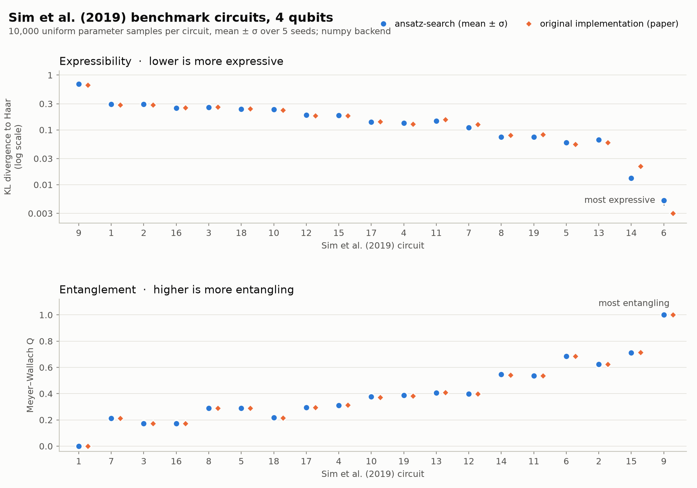

# Examples

The examples plot their results, so install the plotting extra first:
`pip install "ansatz-search[plot]"` (or `uv sync --extra plot`).

| Example | What it shows | Run |
|---|---|---|
| `quickstart.py` | Search → evaluate next to the Sim et al. (2019) circuits → plot, in about a minute | `python examples/quickstart.py` |
| `custom_metric.py` | Writing your own metric; combining metrics with priorities and thresholds | `python examples/custom_metric.py` |
| `hardware_expressibility.py` | Expressibility measured by compute–uncompute on a simulated IBM device, next to ideal simulation; how to switch to real hardware. Needs the `ibm` extra | `python examples/hardware_expressibility.py` |
| `benchmarks/plot_sim2019.py` | Expressibility and entanglement of the 19 Sim et al. (2019) circuits, compared with the values of the original implementation used for the paper | `python examples/benchmarks/plot_sim2019.py` |

`benchmarks/plot_sim2019.py` produces this figure:

`quickstart.py` and `custom_metric.py` write to `examples/runs/` (ignored by git).
Both accept `--trials` and `--out`. Running one again with the same `--out`
continues its stored search.
